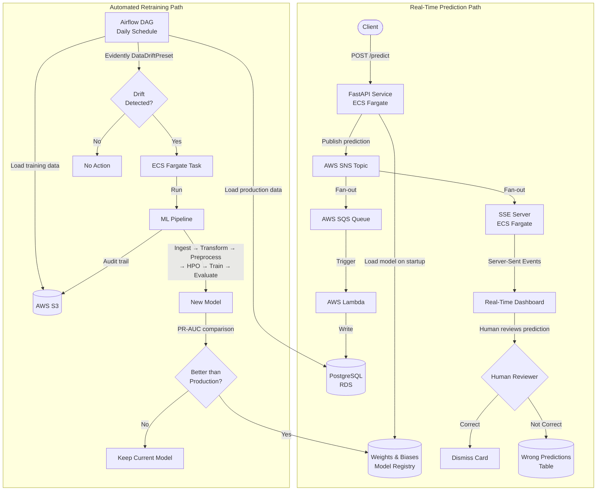

# Credit Card Fraud Detection — End-to-End MLOps System

> A production-grade MLOps platform featuring automated model retraining, data drift detection, human-in-the-loop feedback, real-time monitoring, and full AWS deployment — built with clean, testable, protocol-driven architecture.


---

## Key Highlights

- **Nine-stage ML pipeline** — ingestion, transformation, preprocessing, hyperparameter tuning (100 Optuna trials each for XGBoost and LightGBM), training, evaluation, S3 audit trail, model versioning, and automated promotion
- **Automated drift detection** — daily Airflow DAG compares training data (S3) against production data (PostgreSQL) using Evidently's DataDriftPreset
- **Auto-retraining** — ECS Fargate task triggered automatically when feature drift exceeds the configured threshold
- **Human-in-the-loop** — real-time SSE dashboard displays model predictions; reviewers validate or reject predictions, feeding incorrect labels back into the system for model improvement
- **Production model versioning** — W&B staging/production aliases with automated promotion (new model must beat current production PR-AUC to be promoted)
- **84 automated tests** (unit + integration) across API and pipeline, gated in CI/CD before ECR image push
- **Protocol-based architecture** — `StorageProtocol`, `ModelVersioningProtocol`, `BaseModelStrategy` for testable, swappable implementations
- **Full AWS deployment** — ECS Fargate services, Lambda (SQS-triggered), RDS PostgreSQL, SNS fan-out, Secrets Manager, ALB, ECR

---

## Architecture



---

## Tech Stack

| Category | Technologies |
|---|---|
| **ML / Data Science** | XGBoost, LightGBM, scikit-learn, Optuna (hyperparameter optimization), Evidently (drift detection + evaluation reports) |
| **API / Backend** | FastAPI, Pydantic, uvicorn |
| **Experiment Tracking** | Weights & Biases (experiment tracking, model versioning with staging/production aliases) |
| **AWS Infrastructure** | S3, SNS, SQS, Lambda, ECS/Fargate, RDS PostgreSQL, Secrets Manager, ALB, ECR |
| **Orchestration** | Apache Airflow (daily drift detection DAG) |
| **Containerization** | Docker (python:3.12-slim base, uv package manager) |
| **CI/CD** | GitHub Actions (test → build → push to ECR) |
| **Testing** | pytest (84 tests), Locust (load testing) |
| **Frontend** | HTML/JS with Server-Sent Events |

---

## Project Structure

```
.
├── .github/workflows/
│   └── deploy-to-ecr.yml          # CI/CD: test → build → push to ECR
├── Dockerfiles/
│   ├── Dockerfile.api              # API service container
│   ├── Dockerfile.pipeline         # ML pipeline container
│   └── Dockerfile.sse              # SSE server container
├── services/
│   ├── api/                        # FastAPI prediction service
│   │   ├── app/
│   │   │   ├── main.py             # Lifespan: load model from W&B on startup
│   │   │   ├── routes/             # /predict, /batch-predict, /health
│   │   │   ├── schemas/            # Pydantic request/response models
│   │   │   ├── sns_publish.py      # Publish predictions to SNS
│   │   │   └── utils/              # Logging
│   │   ├── tests/                  # 71 tests (unit + integration)
│   │   └── load_test_locust/       # Locust load testing config
│   ├── pipeline/                   # ML training pipeline
│   │   ├── mlops_pipeline/
│   │   │   ├── __main__.py         # Pipeline entry point
│   │   │   ├── src/                # Pipeline stages (ingestion → promotion)
│   │   │   ├── protocols/          # StorageProtocol, ModelVersioningProtocol
│   │   │   ├── strategies/         # BaseModelStrategy (XGBoost, LightGBM)
│   │   │   ├── repositories/       # S3Storage, WandbRepository implementations
│   │   │   ├── configs/            # Dataclass configs (S3, W&B, preprocessing)
│   │   │   ├── schemas/            # Data containers, HPO result types
│   │   │   └── exceptions.py       # Custom exception hierarchy
│   │   └── tests/                  # 13 tests with fake storage
│   ├── lambda_db_write/            # SQS-triggered Lambda → PostgreSQL
│   ├── sse_server/                 # FastAPI SSE server (SNS → browser)
│   ├── airflow/                    # Daily drift detection DAG
│   │   └── dags/
│   │       └── drift_check.py      # Evidently drift → ECS trigger
│   └── UI_dashboard/               # Real-time human-in-the-loop dashboard
│       └── index.html
└── README.md
```

---

## Services

### 1. ML Pipeline (`services/pipeline/`)

A nine-stage pipeline orchestrated by `PipelineRunner`. Each run creates a timestamped S3 prefix (`pipeline_YYYY_MM_DD_HH_MM_SS/`) for full auditability.

| Stage | Description |
|---|---|
| **Data Ingestion** | Reads raw CSV from S3 |
| **Data Transformation** | Stratified train/validation/test split (60/20/20) |
| **Data Preprocessing** | `ColumnTransformer` with `SimpleImputer(mean)` + `StandardScaler` on 29 numerical features |
| **Data Upload** | Uploads preprocessed splits to S3 for audit |
| **Hyperparameter Tuning** | 100 Optuna trials each for XGBoost and LightGBM, optimizing PR-AUC with early stopping |
| **Model Training** | Combines train+validation data, retrains with best hyperparameters |
| **Model Upload** | Serializes model via joblib to S3 |
| **Model Evaluation** | Calculates test PR-AUC, generates Evidently ClassificationPreset HTML report |
| **Model Promotion** | Compares staging PR-AUC vs production — promotes only if staging wins |

**Architecture highlights:**
- **Protocol-driven** — `StorageProtocol` and `ModelVersioningProtocol` allow swapping S3 for local storage or W&B for MLflow without changing pipeline logic
- **Strategy pattern** — `BaseModelStrategy` ABC with `XGBoostStrategy` and `LightGBMStrategy`; add new models by implementing `objective()` and `start_hyperparameter_tuning()`
- **Class imbalance handling** — automatic `scale_pos_weight` calculation based on class distribution
- **Custom exception hierarchy** — `PipelineError` base with granular subtypes: `IngestionError`, `TransformationError`, `PreprocessingError`, `TuningError`, `TrainingError`, `EvaluationError`, `PromotionError`, `StorageError`, `ArtifactError`

### 2. Fraud Detection API (`services/api/`)

FastAPI service that loads the production model from W&B on startup and serves real-time predictions.

| Endpoint | Method | Description |
|---|---|---|
| `/predict` | POST | Single transaction prediction — publishes result to SNS |
| `/batch-predict` | POST | Batch inference for multiple transactions |
| `/health` | GET | Health check with model loaded status |

- **Model loading** — on startup via FastAPI lifespan, downloads production model + preprocessor artifacts from W&B
- **Secrets management** — credentials loaded from AWS Secrets Manager
- **SNS publishing** — each real-time prediction is published with `transaction_id`, features, and prediction to an SNS topic for downstream consumers
- **Validation** — Pydantic schemas enforce 29 float features (V1-V28 + Amount)

### 3. Lambda DB Writer (`services/lambda_db_write/`)

SQS-triggered Lambda function that persists prediction data to PostgreSQL.

- **Trigger** — SQS queue subscribed to SNS topic
- **Database** — SQLAlchemy ORM with PostgreSQL (RDS)
- **Idempotency** — `ON CONFLICT DO NOTHING` handles duplicate SQS deliveries
- **Partial batch failure** — returns `batchItemFailures` so only failed records are retried

### 4. SSE Server (`services/sse_server/`)

FastAPI server that bridges SNS notifications to browser clients via Server-Sent Events.

- **SNS subscription** — `POST /sns` endpoint auto-confirms SNS subscription and queues incoming messages
- **Real-time broadcast** — `GET /events` streams predictions to connected clients via `asyncio.Queue`-per-client
- **Client management** — automatic cleanup of disconnected clients

### 5. Real-Time Dashboard (`services/UI_dashboard/`)

Browser-based dashboard for human-in-the-loop fraud review.

- **Real-time updates** — connects to SSE server, displays transaction cards as predictions arrive
- **Visual classification** — red border for fraud predictions, green for safe
- **Human feedback** — each card has "Correct" and "Not Correct" buttons
  - **Correct** — dismisses the card (prediction was accurate)
  - **Not Correct** — flags the prediction as wrong; payload and actual label written to a `wrong_predictions` table for model improvement

### 6. Airflow DAG (`services/airflow/`)

Daily scheduled DAG that monitors data drift and triggers retraining.

- **Schedule** — `@daily`
- **Drift detection** — loads training data from S3 and production data from PostgreSQL, runs Evidently `DataDriftPreset`
- **Threshold** — triggers retraining if >50% of features have drifted
- **Auto-retraining** — uses `EcsRunTaskOperator` to launch the ML pipeline on Fargate
- **Short-circuit** — skips ECS trigger entirely if no drift is detected

---

## S3 Audit Trail

Each pipeline run creates a complete, timestamped audit trail in S3:

```
pipeline_2026_04_14_00_51_12/
├── data/
│   ├── preprocessed_train_data.csv
│   ├── preprocessed_train_labels.csv
│   ├── preprocessed_validation_data.csv
│   ├── preprocessed_validation_labels.csv
│   ├── preprocessed_test_data.csv
│   └── preprocessed_test_labels.csv
├── models/
│   └── model.joblib
└── reports/
    └── eval_report.html              # Evidently ClassificationPreset report
```

This ensures every pipeline run is fully reproducible and auditable — you can trace back exactly what data was used, what model was produced, and how it performed.

---

## API Usage

**Single prediction:**
```bash
curl -X POST http://localhost:8000/predict \
  -H "Content-Type: application/json" \
  -d '{
    "V1": -3.043541, "V2": -3.157307, "V3": 1.088463,
    "V4": 2.288644, "V5": 1.359805, "V6": 1.064823,
    "V7": 0.325574, "V8": -0.067794, "V9": -0.270953,
    "V10": -0.838587, "V11": -0.414575, "V12": -0.503141,
    "V13": 0.676502, "V14": -1.692029, "V15": 2.000635,
    "V16": 0.666780, "V17": 0.867832, "V18": 1.725321,
    "V19": 0.283345, "V20": 2.102339, "V21": 0.661696,
    "V22": 0.435477, "V23": 1.375966, "V24": -0.293803,
    "V25": 0.279798, "V26": -0.145362, "V27": -0.252773,
    "V28": 0.035764, "Amount": 529.0
  }'
```

**Response:**
```json
{
  "prediction": 1,
  "probability": 0.9946733117103577
}
```

**Health check:**
```bash
curl http://localhost:8000/health
```
```json
{
  "status": "ok",
  "model_loaded": true
}
```

**Batch prediction:**
```bash
curl -X POST http://localhost:8000/batch-predict \
  -H "Content-Type: application/json" \
  -d '{"data": [{"V1": -1.36, "V2": -0.07, ..., "Amount": 149.62}, {"V1": 1.19, "V2": 0.26, ..., "Amount": 2.69}]}'
```

---

## Getting Started

### Prerequisites

- Python 3.12+
- Docker
- AWS account (S3, SNS, SQS, Lambda, ECS, RDS, Secrets Manager)
- [Weights & Biases](https://wandb.ai) account
- Apache Airflow instance (for drift detection)

<details>
<summary><b>1. ML Pipeline Setup</b></summary>

```bash
cd services/pipeline
```

**Environment variables** — create `pipeline.env`:
```env
bucket=your-s3-bucket-name
aws_access=your-aws-access-key
aws_secret=your-aws-secret-key
WANDB_API_KEY=your-wandb-api-key
WANDB_DIR=/tmp/wandb
WANDB_CACHE_DIR=/tmp/wandb_cache
WANDB_SILENT=true
```

**Run locally:**
```bash
uv sync
uv run python -m mlops_pipeline
```

**Run with Docker:**
```bash
docker build -f Dockerfiles/Dockerfile.pipeline -t fraud-pipeline .
docker run --env-file services/pipeline/pipeline.env fraud-pipeline
```

</details>

<details>
<summary><b>2. Fraud Detection API Setup</b></summary>

```bash
cd services/api
```

**Environment variables** — create `api.env`:
```env
AWS_ACCESS_KEY_ID=your-aws-access-key
AWS_SECRET_ACCESS_KEY=your-aws-secret-key
AWS_REGION=your-aws-region
WANDB_API_KEY=your-wandb-api-key
WANDB_DIR=/tmp/wandb
WANDB_CACHE_DIR=/tmp/wandb_cache
WANDB_SILENT=true
AWS_SNS_ARN=your-sns-topic-arn
db_link=your-sqlalchemy-postgres-connection-string
bucket=your-s3-bucket-name
```

**Run locally:**
```bash
uv sync
uv run uvicorn app.main:app --host 0.0.0.0 --port 8000
```

**Run with Docker:**
```bash
docker build -f Dockerfiles/Dockerfile.api -t fraud-api .
docker run --env-file services/api/api.env -p 8000:8000 fraud-api
```

</details>

<details>
<summary><b>3. Lambda DB Writer Setup</b></summary>

**Environment variables:**
```env
DB_HOST=your-rds-endpoint
DB_PORT=5432
DB_NAME=your-database-name
DB_USER=your-db-user
DB_PASSWORD=your-db-password
```

Deploy as an AWS Lambda function with an SQS trigger subscribed to the SNS topic. Package `lambda_db.py` with `sqlalchemy` and `psycopg2` dependencies.

</details>

<details>
<summary><b>4. SSE Server Setup</b></summary>

```bash
cd services/sse_server
```

**Run locally:**
```bash
pip install fastapi uvicorn httpx
uvicorn server:app --host 0.0.0.0 --port 8000
```

**Run with Docker:**
```bash
docker build -f Dockerfiles/Dockerfile.sse -t fraud-sse .
docker run -p 8000:8000 fraud-sse
```

Subscribe the SSE server's `/sns` endpoint to your SNS topic.

</details>

<details>
<summary><b>5. Dashboard Setup</b></summary>

Open `services/UI_dashboard/index.html` in a browser. Update the `SSE_URL` constant to point to your SSE server endpoint.

</details>

<details>
<summary><b>6. Airflow DAG Setup</b></summary>

Copy `services/airflow/dags/drift_check.py` to your Airflow DAGs folder. Update the following in the DAG file:

- `S3_BUCKET` — your S3 bucket name
- `S3_KEY` — path to training data CSV
- `SUBNETS` / `SECURITY_GROUPS` — your VPC configuration
- `ECS_CLUSTER` / `ECS_TASK_DEFINITION` / `ECS_CONTAINER_NAME` — your ECS configuration
- PostgreSQL connection details

</details>

---

## Testing

| Service | Unit Tests | Integration Tests | Total |
|---|---|---|---|
| API | 26 | 45 | **71** |
| Pipeline | 13 | — | **13** |
| **Total** | **39** | **45** | **84** |

```bash
# Run API tests
cd services/api && uv run pytest -v

# Run pipeline tests
cd services/pipeline && uv run pytest -v

# Load testing with Locust
cd services/api/load_test_locust && locust -f locustfile.py
```

---

## CI/CD Pipeline

GitHub Actions workflow (`.github/workflows/deploy-to-ecr.yml`) runs on every push and PR to `main`:

```
test-api ─────────► build-and-push-api ─────────► ECR
                         (only on main merge)

test-pipeline ────► build-and-push-pipeline ────► ECR
                         (only on main merge)
```

- **Test gate** — Docker images are only built after all tests pass
- **Image tagging** — images tagged with both `git SHA` and `latest`
- **Push gate** — images pushed to ECR only on merge to `main` (PRs build but don't push)

---

## Design Decisions

**Protocol-based abstractions** — `StorageProtocol` and `ModelVersioningProtocol` decouple the pipeline from specific implementations. S3 can be swapped for local storage, or W&B for MLflow, without touching pipeline logic. This also enables testing with fakes (see `tests/fakes/fake_storage.py`).

**Strategy pattern for model selection** — new model types can be added by implementing `BaseModelStrategy.objective()` and `start_hyperparameter_tuning()`. The `MasterTuner` and `PipelineRunner` require zero changes.

**Custom exception hierarchy** — granular exception classes (`IngestionError`, `TuningError`, `PromotionError`, etc.) under a common `PipelineError` base enable targeted error handling and clear error provenance in logs.

**Event-driven architecture** — SNS fan-out pattern decouples the API from downstream consumers. The Lambda DB writer and SSE server scale independently and can be added or removed without modifying the API.

---

## Dataset

This project uses the [Kaggle Credit Card Fraud Detection](https://www.kaggle.com/datasets/mlg-ulb/creditcardfraud) dataset:

- **284,807** transactions over 2 days
- **492** fraudulent transactions (0.17% — highly imbalanced)
- **Features:** V1–V28 (PCA-transformed), Time, Amount
- **Target:** Class (0 = legitimate, 1 = fraud)

The extreme class imbalance is why the system uses **PR-AUC** (Precision-Recall Area Under Curve) as the primary metric instead of accuracy, and applies `scale_pos_weight` during model training.

---

## License

This project is for educational and portfolio purposes.
